Graph Analytics of Alice's Adventures in Wonderland
================
Oisin McNally - 14376701
April 5, 2019

### Introduction

This assignment involves the use of graph analytics to the text analysis domain. The book *Alice's Adventures in Wonderland by Lewis Carroll* was downloaded from the [Project Guttenberg](http://www.gutenberg.org/ebooks/11)\[1\] archive and separated into text files by chapter.

A number of graph-analytic approaches were used to attempt to summarise the main themes and relationships in the book while providing an insight into important topics in the story line.

### Libraries

``` r
library(stringr) # text cleaning and regular expressions
library(tidytext) # provides additional text mining functions
library(widyr) # widen, process, tidy data
library(dplyr) # data manipulation
library(tidyr) # data tidying
library(tibble) # data type
library(igraph) # graph library
library(tidygraph) # tidy framework for igraph
library(ggraph) # graph librar for igraph
library(ggpubr) # used for matrix graph layout
```

Book As A Network
-----------------

The book was manually separated by chapter into a number of text files. The process from importing the files to the resulting graph can be summarised as;

1.  Create tibble of words and each chapter they occurs in
2.  Find correlations between words that occur in different chapters.
3.  Calculate graph measures such as centrality, diameter, radius and eccentricity.
4.  Graph the resulting network.

``` r
#################################################
############### Read in Book ####################
#################################################

# Read the text files
book_title = "Alice's Adventures in Wonderland"
chapters = 1:12
chapter_stem = "alice"
ext <-".txt"
folder<- "alice/"

book <- tibble()

# read in each chapter
for(i in chapters){
  
  chapter <-paste0(folder,chapter_stem,i,ext)
  
  raw<-readChar(chapter, file.info(chapter)$size)
  
  chapter_text <- raw %>%
    gsub("[\r\n]+", " ", .) %>%
    gsub('^"',"",.) %>%
    gsub('"$',"",.)
  
  #creates a tibble with 3 cols: book_title, chapter, word
  words <- tibble(title = book_title, chapter=i, text = chapter_text) %>%
    unnest_tokens(word, text) %>% # tokenise the text
    filter(!word %in% stop_words$word) # remove stop words
  
  book <- rbind(book, words) # add rows to the book tibble
}
```

After the book was read in, the pairwise correlation was performed. Words that occurred at least 8 times were selected which results in a graph of 928 nodes. If the filter for number of occurrences was reduced the set of nodes becomes larger but more general, too high and the nodes become very specific but sparse.

A correlation score of at least 0.6 was required as it was sufficient for this exercise. By increasing the correlation requirement too high the network produced is separated into a large number of small communities and is not well connected overall. If the number is too low then the communities produced are very large and do not have specific meaning to them.

``` r
#################################################
############### Word Correlation ################
#################################################
word_cor <- book %>%
  group_by(word) %>%
  filter(n() >= 8) %>% # minimum number of word pairs to consider; determines the number of nodes; lower value -> more nodes
  pairwise_cor(item=word, feature=chapter) %>% 
  filter(!is.na(correlation), correlation >= 0.6) # minimum correlation; determines the number of edges
```

Multiple edges were removed from the graph (such as *hello -&gt; there* and *there -&gt; hello*) and the degree centrality, graph radius, graph diameter and node eccentricity were calculated. These measurements were then stored in a tibble so they could used in the graph title.

``` r
#################################################
############### Graph and Measurements ##########
#################################################
correlation_graph <- as_tbl_graph(word_cor, directed = F) %>%
  activate(edges) %>%
  filter(!edge_is_multiple()) # (hello,alice) same as (alice,hello)

original_graph <- correlation_graph %>% 
  activate(nodes) %>%
  mutate(centrality = centrality_degree(),
         diameter = graph_diameter(),
         radius = graph_radius(),
         eccentricity = node_eccentricity())

original_graph_measurements <- as_tibble(original_graph)
```

The network was plotted and the node labels were colored by degree. An observation on the centrality of the network is the nodes colored in red with the largest centrality (*glass, hall, court*).

Nodes with a high centrality is an indication of importance in a network as they have a large number of connections to other nodes. Therefore these words most likely represent a main plot in the story.

The degree starts to reduce towards the perimeters of the network where some small networks can be seen to have separated from the main section of the graph. This could indicate that these words have a strong correlation in a section of the story but do not strongly relate to other plots in the story.

``` r
ggraph(original_graph, layout = "fr") +
  geom_edge_link(aes(edge_alpha = 0.7), edge_width=0.5, show.legend = FALSE) +
  geom_node_point(alpha = 0.25, size = 2) +
  geom_node_label(aes(label = name, color = centrality), size = 4, repel = TRUE, segment.color = "white", segment.alpha = 0.7, segment.size = 0.4) + # repel =TRUE stops labels overlapping; but also  attaches a segment line between node and text, which may be visually confusing if it overlaps with graph edges and nodes
  theme_void() +
  scale_color_gradient(low = 'green', high = 'red') +
  labs(title = "Original Graph",
       subtitle = paste("Diameter = ", sample(original_graph_measurements$diameter, 1),
                        " | Radius = ", sample(original_graph_measurements$radius, 1))) +
  theme(plot.title = element_text(hjust = 0.5, face = "bold"),
        plot.subtitle = element_text(hjust = 0.5, face = 'bold'))
```

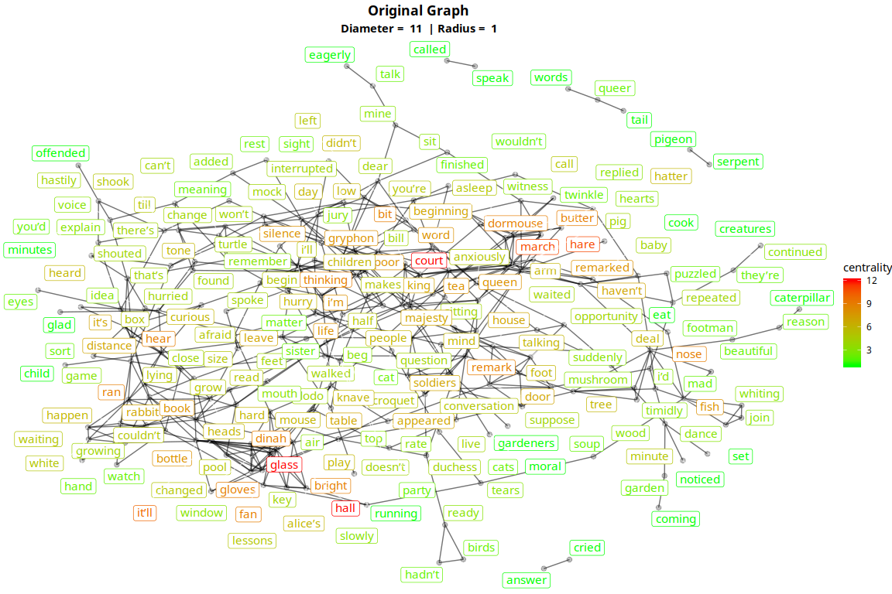

Another interesting visualisation of the network is to color the node labels by eccentricity. The eccentricity of a node is the distance between that node and any other node in the the connected network. The diameter represents the max eccentricity and the radius represents the minimum eccentricity.

The nodes colored in green have a very low eccentricity as they are from their own network and disconnected from the main network, hence the distance between the nodes is very small.

In the main network the nodes at the edges have the highest eccentricity as they would be the furthest away from other nodes in the graph. The nodes in the center have an eccentricity in the middle of the range as they are approximately the same distance in any direction from other nodes in the network.

``` r
ggraph(original_graph, layout = "fr") +
  geom_edge_link(aes(edge_alpha = 0.7), edge_width=0.5, show.legend = FALSE) +
  geom_node_point(alpha = 0.25, size = 2) +
  geom_node_label(aes(label = name, color = eccentricity), size = 4, repel = TRUE, segment.color = "white", segment.alpha = 0.7, segment.size = 0.4) + # repel =TRUE stops labels overlapping; but also  attaches a segment line between node and text, which may be visually confusing if it overlaps with graph edges and nodes
  theme_void() +
  scale_color_gradient(low = 'green', high = 'red') +
  labs(title = "Original Graph",
       subtitle = paste("Diameter = ", sample(original_graph_measurements$diameter, 1),
                        " | Radius = ", sample(original_graph_measurements$radius, 1))) +
  theme(plot.title = element_text(hjust = 0.5, face = "bold"),
        plot.subtitle = element_text(hjust = 0.5, face = 'bold'))
```

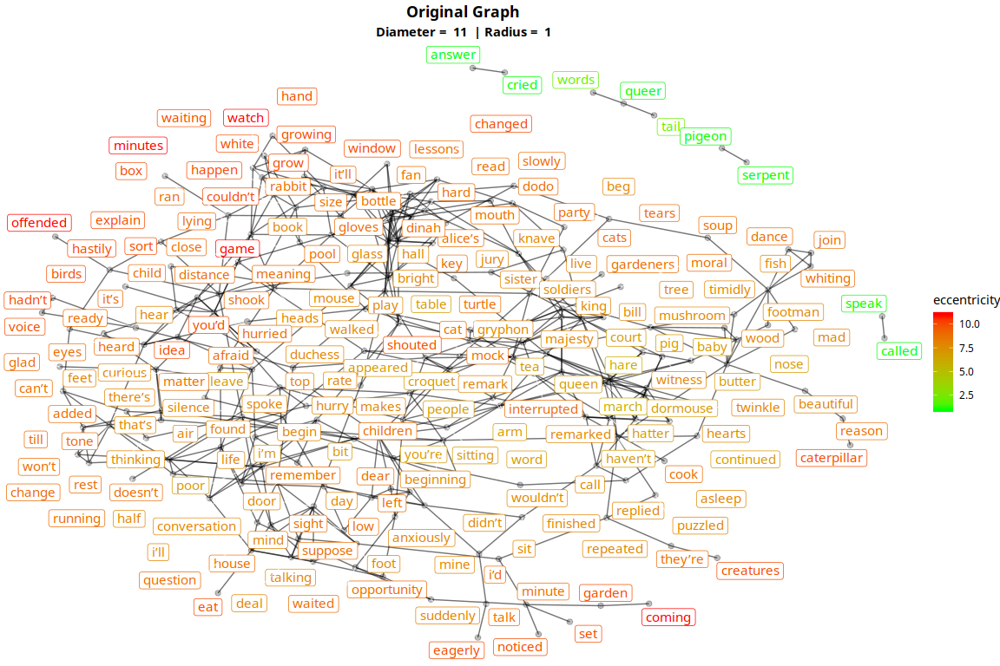

Community Detection
-------------------

Community detection is used to find clusters in the network with strong internal connections and weak connections between different clusters. This can help to break down a large network into smaller networks in which more meaning could be derived from.

For the purpose of this assignment, two community detection algorithms were compared and each community was treated as a sub-graph with graph measures used to explain their relevance.

A function to separate a clustered network into separate networks for each cluster had to be manually implemented along with a function to generate a ggraph for each network.

``` r
#################################################
############### Community Detection #############
#################################################

###################
##### Functions ###
###################
## seperates a community detected igraph into a list 
# of separate graphs based on community
get_community_graphs <- function(community_graph) {
  community_graph <- community_graph %>% 
    activate(nodes) # activate node table
  
  graph_tibble <- community_graph %>%
    as_tibble()
  max_community <- max(graph_tibble$community) # get max number of communities
  
  community_list = list()
  current_community <- 1
  while(current_community <= max_community) {
    # filter original network by current community and store partitioned network in a list
    community_list[[current_community]] <- community_graph %>% filter(community == current_community)
    current_community <- current_community + 1
  }
  community_list
}

# generates a ggraph for a network cluster in tidy_graph format
get_community_ggraph <- function(tidy_graph) {
  tidy_graph <- tidy_graph %>% 
    activate(nodes) %>%
    mutate(centrality = centrality_degree(),
           diameter = graph_diameter(),
           radius = graph_radius(),
           eccentricity = node_eccentricity())
  
  tidy_graph_measurements <- tidy_graph %>% as_tibble()
  
  community_ggplot <- ggraph(tidy_graph, layout = "fr") +
    geom_edge_link(aes(edge_alpha = 0.7), edge_width=0.5, show.legend = FALSE) +
    geom_node_point(alpha = 0.25, size = 2) +
    geom_node_label(aes(label = name, color = centrality), size = 4, repel = TRUE, segment.color = "red", segment.alpha = 0.7, segment.size = 0.4) + # repel =TRUE stops labels overlapping; but also  attaches a segment line between node and text, which may be visually confusing if it overlaps with graph edges and nodes
    theme_void() +
    scale_color_gradient(low = 'green', high = 'red') +
    labs(title = paste("Community = ", sample(tidy_graph_measurements$community, 1)),
         subtitle = paste("Diamater = ", sample(tidy_graph_measurements$diameter, 1),
                          " | Radius = ", sample(tidy_graph_measurements$radius, 1),
                          "| Nodes = ", length(tidy_graph_measurements$radius))) +
    theme(plot.title = element_text(hjust = 0.5, face = "bold"),
          plot.subtitle = element_text(hjust = 0.5, face = 'bold'))
}
```

### 1. Fast Greedy

Fast Greedy attempts to optimize the modularity of communities by treating each edge as a separate community and merging communities together that results in the largest increase in modularity.

This algorithm was run on the original network and the 13 communities were found with node labels were colored by community.

``` r
###################
### Fast-Greedy ###
###################
community.fg <- correlation_graph %>%
  activate(nodes) %>%
  mutate(community = group_fast_greedy())

community.fg_measurements <- community.fg %>%
  as_tibble()

# plot network colored by cluster
ggraph(community.fg, layout = "fr") +
  geom_edge_link(aes(edge_alpha = 0.7), edge_width=0.5, show.legend = FALSE) +
  geom_node_point(aes(color = factor(community)), alpha = 0.25, size = 2) +
  geom_node_label(aes(label = name, color = factor(community)), size = 4, repel = TRUE, segment.color = "red", segment.alpha = 0.7, segment.size = 0.4) + # repel =TRUE stops labels overlapping; but also  attaches a segment line between node and text, which may be visually confusing if it overlaps with graph edges and nodes
  theme_void() +
  labs(title = "Fast Greedy Community Detection",
       subtitle = paste("Communities = ", max(community.fg_measurements$community)),
       color = "Community") +
  theme(plot.title = element_text(hjust = 0.5, face = "bold"),
        plot.subtitle = element_text(hjust = 0.5, face = 'bold'))
```

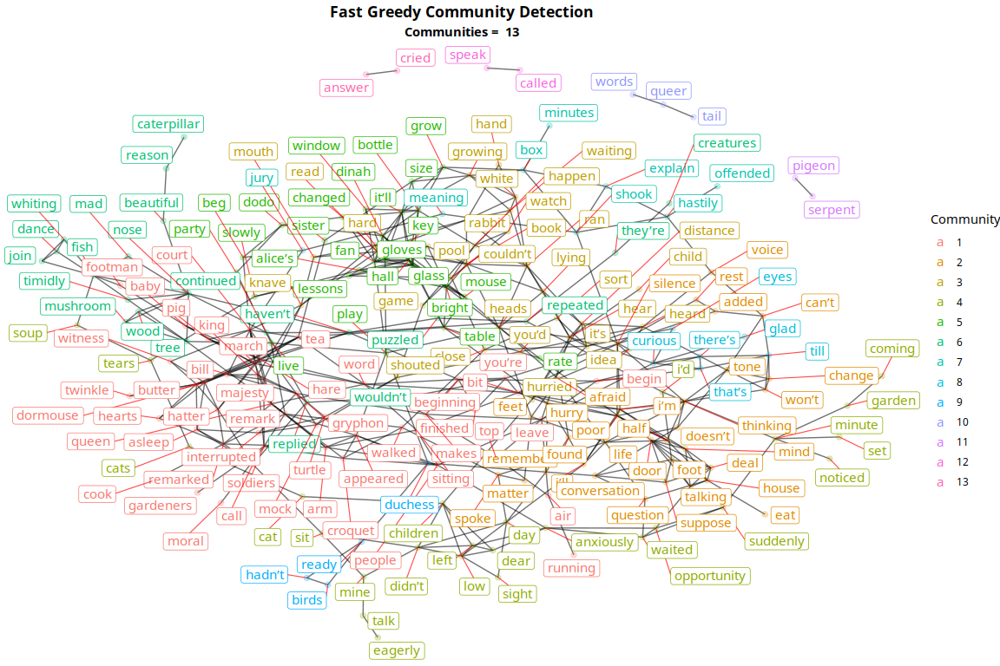

From a quick glance, the results of the community detection do not seem very surprising. The networks disconnected from the main network have been mostly labeled as their own communities while there have also been a number of communities found in the main network.

It is still difficult to distinguish each community from each other, hence the network was segregated by community and a graph was produced for each separate community.

The network was filtered for communities with members greater than 5 as small networks did not help much in extracting meaning about the story line.

``` r
# remove small clusters
community.fg <- community.fg %>%
  group_by(community) %>%
  filter(n() > 5) %>%
  ungroup() 

# separate clustered graph into separate graphs for each cluster
community_graphs <- get_community_graphs(community.fg) # return tbl_graph for each community

# get ggplot for each cluster
community_ggplots <- lapply(community_graphs, get_community_ggraph)
ggarrange(plotlist = community_ggplots, ncol = 3, nrow = 3)
```

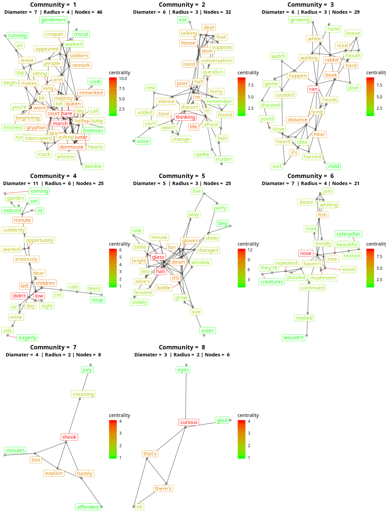

The communities produced are coloured by centrality where high centrality nodes appear in red. Each community gives an insight into the possible topics in the story. An interpretation of the communities could be;

1.  This community contains the names of a number of characters such as *hare, queen, king, soldiers, gardeners, turtle*. Words like *sitting, tea, interrupted, people* may signify a meeting or discussion between the characters.

2.  This community seems to involve much more emotions and thoughts. The word *thinking* has a high centrality indicating its importance while words like *silence, conversation, life, question, mind, tone* and *hurry* indicate this topic could be an emotional or striking topic in the story.

3.  The word *ran* is of importance in this community. The topic of this network could be about a main event of action in the story. Words like *distance, hurried, growing, shouted, happen, heard* and *lying* are mostly words associated with action and events. The words *white rabbit* are also visible indicating this character may have been involved in these events.

4.  Terms such as *anxiously, waited, opportunity, suddenly, coming, garden* could indicate an event happening in a garden where the character was hiding or in a time of trouble.

5.  *glass, hall, bottle, grow, size* indicate an event occurring in a hall where the main character changes size possibly because of something in a bottle.

6.  The words in this community indicate a scene in nature. This is enforced by words such as *caterpillar, mushroom, beautiful, tree, fish, wood* and *creatures*.

7.  A small community indicating another possible event of despair enforced by words such as *shook, offended, hastily* and *explain*.

8.  Another small network where meaning is difficult to extract. Words like *curious* and *eyes* indicate the character may be looking something or being watched.

### 2. Louvain

The Louvain algorithm is an agglomerative approach to community detection. It also uses modularity maximisation to discover small communities and merge them to discover larger ones.

The number of communities found using Louvain was 14. This is similar to the amount found by Fast Greedy.

``` r
#######################
### Louvain ###########
#######################
community.lv <- correlation_graph %>%
  activate(nodes) %>%
  mutate(community = group_louvain())

community.lv_measurements <- community.lv %>%
  as_tibble()

# plot network colored by cluster
ggraph(community.lv, layout = "fr") +
  geom_edge_link(aes(edge_alpha = 0.7), edge_width=0.5, show.legend = FALSE) +
  geom_node_point(aes(color = factor(community)), alpha = 0.25, size = 2) +
  geom_node_label(aes(label = name, color = factor(community)), size = 4, repel = TRUE, segment.color = "red", segment.alpha = 0.7, segment.size = 0.4) + # repel =TRUE stops labels overlapping; but also  attaches a segment line between node and text, which may be visually confusing if it overlaps with graph edges and nodes
  theme_void() +
  labs(title = "Louvain Community Detection",
       subtitle = paste("Communities = ", max(community.lv_measurements$community)),
       color = "Community") +
  theme(plot.title = element_text(hjust = 0.5, face = "bold"),
        plot.subtitle = element_text(hjust = 0.5, face = 'bold'))
```

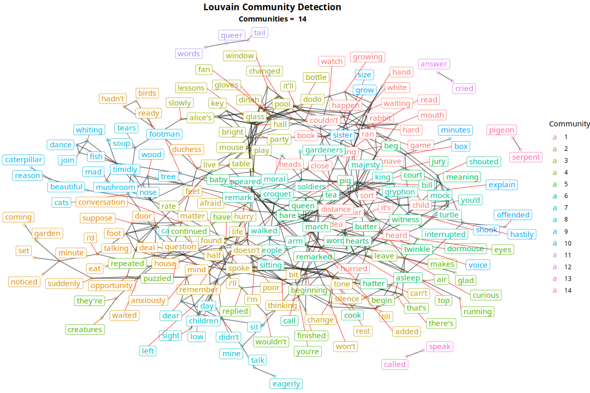

``` r
# remove small clusters
community.lv <- community.lv %>%
  group_by(community) %>%
  filter(n() > 5) %>%
  ungroup() 

# separate clustered graph into separate graphs for each cluster
community_graphs <- get_community_graphs(community.lv) # return tbl_graph for each community

# get ggplot for each cluster
community_ggplots <- lapply(community_graphs, get_community_ggraph)
ggarrange(plotlist = community_ggplots, ncol = 3, nrow = 4)
```

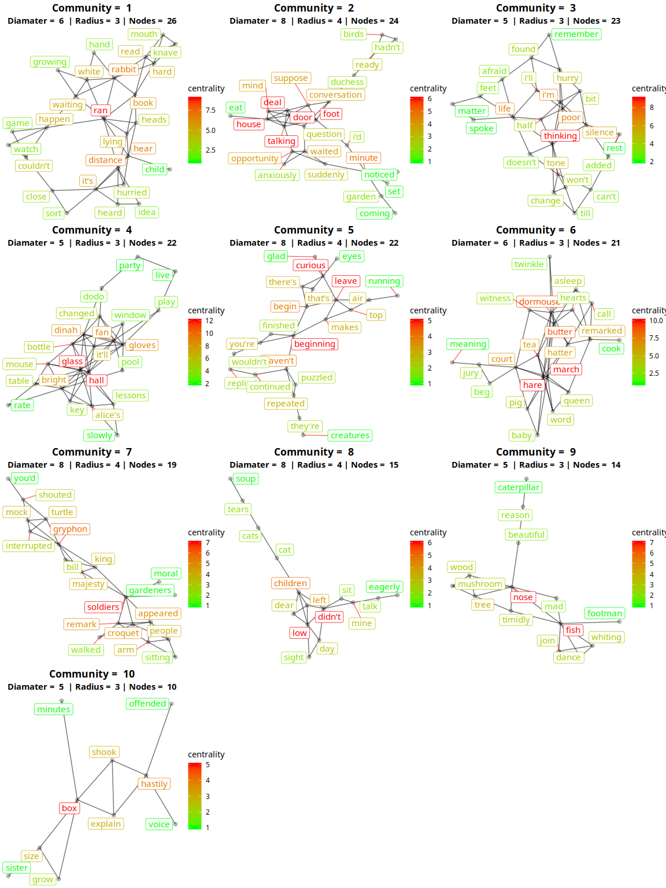

The communities produced by Louvain can be seen to have similar information to the communities produced earlier by Fast Greedy.

The clusters appear to have more words of high centrality possibly giving a better insight into the important points in the topic each community represents. There is also slightly more clusters found of of size greater than 5.

An analysis of these communities could be:

1.  Action scene with the white rabbit (*ran, distance, happen, waiting, hear, hurried*).

2.  Possibly a action scene involving a house or garden due to words like *opportunity, door, house, garden, talking, suddenly, noticed, coming*.

3.  A similar topic was identified earlier where thoughts and emotions are discussed. This is due to terms such as *thinking, silence, life, afraid, remember, change, tone*.

4.  The words *glass, hall* and *bottle* are seen again enforcing the topic earlier where this scene could involve an event occurring to the main character (as we see the word *alice's*) in a hall.

5.  A scene involving confusion or investigation due to the terms *confusion, running, leave, puzzled*.

6.  This scene could involve a a court meeting between a number of characters. A number of character names are seen such as *march hare, doormouse, queen* and *hatter* in combination with the courtroom words such as *court, jury, witness* and *beg*.

7.  Possibly a stern scene outdoors between multiple characters playing croquet. Enforced by terms such as *croquet, gardeners, people, walked* and *soldiers*.

8.  Difficult to extract meaning from this community. Terms like *children, sit, talk, eagerly* and *cat* indicate a possible conversation between people involving a cat.

9.  A similar community centered around nature which was also produced using the previous algorithm.

10. A similar community surrounding the idea of an event of despair which was also found using the previous algorithm.

N-gram Model
------------

Another method of investigation explored was to build n-gram models of the book as a network. The combination of words that appear in multiple occurrences could give a better insight than single words into the topics and relationships in the story.

The networks produced were much more sparse so community detection was not used as a general understanding from each cluster was much easier to extract.

### Bigram Approach

The code used to produce the original graph at the beginning of this report was slightly modified to parse the book using bigrams instead of individual words.

The minimum number of word pairs to considered was lowered as the number of bigram pairs produced (174) was much lower than the number of token pairs produced (928).

``` r
###################################
############### Bigram ############
###################################
book <- tibble()

# read in each chapter
for(i in chapters){
  
  chapter <-paste0(folder,chapter_stem,i,ext)
  
  raw<-readChar(chapter, file.info(chapter)$size)
  
  chapter_text <- raw %>%
    gsub("[\r\n]+", " ", .) %>%
    gsub('^"',"",.) %>%
    gsub('"$',"",.)
  
  #creates a tibble with 3 cols: book_title, chapter, word
  words <- tibble(title = book_title, chapter=i, text = chapter_text) %>%
    unnest_tokens(bigram, text, token = "ngrams", n = 2) %>% # tokenise the text
    separate(bigram, c("word1", "word2"), sep = " ") %>%
    filter(!word1 %in% stop_words$word,
           !word2 %in% stop_words$word) %>% # remove stop words
    unite("bigram", c("word1", "word2"), sep = " ")
  
  book <- rbind(book, words) # add rows to the book tibble
}


#################################################
############### Bigram Correlation ##############
#################################################
bigram_cor <- book %>%
  group_by(bigram) %>%
  filter(n() >= 3) %>% # minimum number of word pairs to consider; determines the number of nodes; lower value -> more nodes
  pairwise_cor(item=bigram, feature=chapter) %>% 
  filter(!is.na(correlation), correlation >= 0.6) # minimum correlation; determines the number of edges


#################################################
############### Graph and Measurements ##########
#################################################
correlation_graph <- as_tbl_graph(bigram_cor, directed = F) %>%
  activate(edges) %>%
  filter(!edge_is_multiple()) # (hello,alice) same as (alice,hello)

original_graph <- correlation_graph %>% 
  activate(nodes) %>%
  mutate(centrality = centrality_degree(),
         diameter = graph_diameter(),
         radius = graph_radius(),
         eccentricity = node_eccentricity())

original_graph_measurements <- as_tibble(original_graph)

ggraph(original_graph, layout = "fr") +
  geom_edge_link(aes(edge_alpha = 0.7), edge_width=0.5, show.legend = FALSE) +
  geom_node_point(alpha = 0.25, size = 2) +
  geom_node_label(aes(label = name, color = centrality), size = 4, repel = TRUE, segment.color = "white", segment.alpha = 0.7, segment.size = 0.4) + # repel =TRUE stops labels overlapping; but also  attaches a segment line between node and text, which may be visually confusing if it overlaps with graph edges and nodes
  theme_void() +
  scale_color_gradient(low = 'green', high = 'red') +
  labs(title = "Original Graph - Bigrams",
       subtitle = paste("Diamater = ", sample(original_graph_measurements$diameter, 1),
                        " | Radius = ", sample(original_graph_measurements$radius, 1))) +
  theme(plot.title = element_text(hjust = 0.5, face = "bold"),
        plot.subtitle = element_text(hjust = 0.5, face = 'bold'))
```

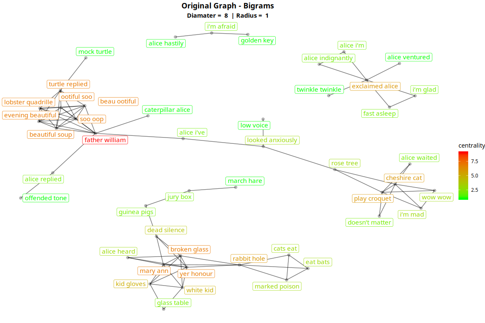

The network produced is much sparser than the individual word network and it is much easier extract meaning from this graph without the use of community detection.

1.  A small cluster at the top right of the network has the bigrams *alice hastily, i'm afraid, golden key* indicating a scene involving the main character using a key in a possible situation of danger.

2.  The cluster on the right contains *cheshire cat, play croquet, rose tree, I'm mad*. These bigrams point towards a scene involving a game of croquet and an interaction between Alice and the Cheshire Cat.

3.  The cluster on the left contains a densely connected cluster of unusual word indicating they have a high correlation between each other. We also see mentions of the Mock Turtle and Caterpillar which are characters in the story.

4.  The cluster to the bottom contains bigrams like *march hare, broken glass, glass table, rabbit hole, marked poison*. This points towards a scene involving the March Hare and possibly a glass of poison involving the main character Alice.

### Trigram Approach

The above process was slightly modified to investigate the use of a trigram model. The network produced was very sparse but some information can be extracted from the graph produced.

``` r
#################################################
############### Trigram Approach ################
#################################################
book <- tibble()

# read in each chapter
for(i in chapters){
  
  chapter <-paste0(folder,chapter_stem,i,ext)
  
  raw<-readChar(chapter, file.info(chapter)$size)
  
  chapter_text <- raw %>%
    gsub("[\r\n]+", " ", .) %>%
    gsub('^"',"",.) %>%
    gsub('"$',"",.)
  
  #creates a tibble with 3 cols: book_title, chapter, word
  words <- tibble(title = book_title, chapter=i, text = chapter_text) %>%
    unnest_tokens(trigram, text, token = "ngrams", n = 3) %>% # tokenise the text
    separate(trigram, c("word1", "word2", "word3"), sep = " ") %>%
    filter(!word1 %in% stop_words$word,
           !word2 %in% stop_words$word,
           !word3 %in% stop_words$word) %>% # remove stop words
    unite("trigram", c("word1", "word2", "word3"), sep = " ")
  
  book <- rbind(book, words) # add rows to the book tibble
}


#################################################
############### Trigram Correlation #############
#################################################
trigram_cor <- book %>%
  group_by(trigram) %>%
  filter(n() >= 2) %>% # minimum number of word pairs to consider; determines the number of nodes; lower value -> more nodes
  pairwise_cor(item=trigram, feature=chapter) %>% 
  filter(!is.na(correlation), correlation >= 0.6) # minimum correlation; determines the number of edges


#################################################
############### Graph and Measurements ##########
#################################################
correlation_graph <- as_tbl_graph(trigram_cor, directed = F) %>%
  activate(edges) %>%
  filter(!edge_is_multiple()) # (hello,alice) same as (alice,hello)

original_graph <- correlation_graph %>% 
  activate(nodes) %>%
  mutate(centrality = centrality_degree(),
         diameter = graph_diameter(),
         radius = graph_radius(),
         eccentricity = node_eccentricity())

original_graph_measurements <- as_tibble(original_graph)

ggraph(original_graph, layout = "fr") +
  geom_edge_link(aes(edge_alpha = 0.7), edge_width=0.5, show.legend = FALSE) +
  geom_node_point(alpha = 0.25, size = 2) +
  geom_node_label(aes(label = name, color = centrality), size = 4, repel = TRUE, segment.color = "white", segment.alpha = 0.7, segment.size = 0.4) + # repel =TRUE stops labels overlapping; but also  attaches a segment line between node and text, which may be visually confusing if it overlaps with graph edges and nodes
  theme_void() +
  scale_color_gradient(low = 'green', high = 'red') +
  labs(title = "Original Graph - Trigrams",
       subtitle = paste("Diamater = ", sample(original_graph_measurements$diameter, 1),
                        " | Radius = ", sample(original_graph_measurements$radius, 1))) +
  theme(plot.title = element_text(hjust = 0.5, face = "bold"),
        plot.subtitle = element_text(hjust = 0.5, face = 'bold'))
```

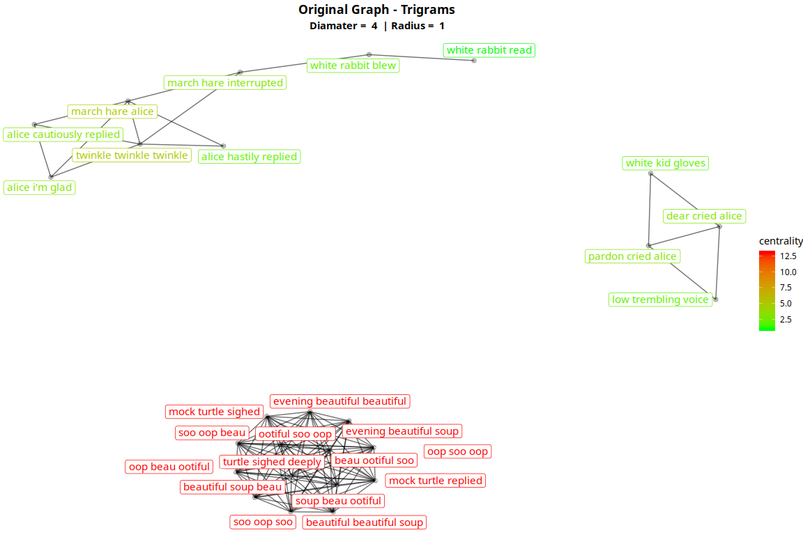

1.  There is a highly connected cluster of high centrality to the right of the graph. These trigrams are slightly unusual and their high centrality between each other indicate they were repeated together possibly in a poem.

2.  The other clusters do not add much to our overall understanding of the story so far. They reinforce interactions between characters such as Alice, White Rabbit and the March Hare.

Book By Section
---------------

This section attempts to investigate the graphs produced by different sections of the book. This is used in an attempt to compare the principle relationships extracted from the first half the book with those extracted from the second half of the book.

### First Half Of The Book

Correlations between words in the first half of the book were extracted and the network was graphed and coloured by centrality. A similar pattern is seen where nodes towards the middle of the network have a high centrality which reduces towards the edges of the graph.

A separate small highly connected network was also produced which is seen towards the bottom right of the graph.

``` r
#################################################
############### Read in Book ####################
#################################################

# Read the text files
book_title = "Alice's Adventures in Wonderland"
chapters = 1:6
chapter_stem = "alice"
ext <-".txt"
folder<- "alice/"

book <- tibble()

# read in each chapter
for(i in chapters){
  
  chapter <-paste0(folder,chapter_stem,i,ext)
  
  raw<-readChar(chapter, file.info(chapter)$size)
  
  chapter_text <- raw %>%
    gsub("[\r\n]+", " ", .) %>%
    gsub('^"',"",.) %>%
    gsub('"$',"",.)
  
  #creates a tibble with 3 cols: book_title, chapter, word
  words <- tibble(title = book_title, chapter=i, text = chapter_text) %>%
    unnest_tokens(word, text) %>% # tokenise the text
    filter(!word %in% stop_words$word) # remove stop words
  
  book <- rbind(book, words) # add rows to the book tibble
  
}


#################################################
############### Word Correlation ######################
#################################################
word_cor <- book %>%
  group_by(word) %>%
  filter(n() >= 7) %>% # minimum number of word pairs to consider; determines the number of nodes; lower value -> more nodes
  pairwise_cor(item=word, feature=chapter) %>% 
  filter(!is.na(correlation), correlation >= 0.6) # minimum correlation; determines the number of edges

#################################################
############### Graph and Measurements ######################
#################################################
correlation_graph <- as_tbl_graph(word_cor, directed = F) %>%
  activate(edges) %>%
  filter(!edge_is_multiple()) # (hello,alice) same as (alice,hello)

original_graph <- correlation_graph %>% 
  activate(nodes) %>%
  mutate(centrality = centrality_degree(),
         diameter = graph_diameter(),
         radius = graph_radius(),
         eccentricity = node_eccentricity())

original_graph_measurements <- as_tibble(original_graph)

ggraph(original_graph, layout = "fr") +
  geom_edge_link(aes(edge_alpha = 0.7), edge_width=0.5, show.legend = FALSE) +
  geom_node_point(alpha = 0.25, size = 2) +
  geom_node_label(aes(label = name, color = centrality), size = 4, repel = TRUE, segment.color = "white", segment.alpha = 0.7, segment.size = 0.4) + # repel =TRUE stops labels overlapping; but also  attaches a segment line between node and text, which may be visually confusing if it overlaps with graph edges and nodes
  theme_void() +
  scale_color_gradient(low = 'green', high = 'red') +
  labs(title = "Original Graph",
       subtitle = paste("Diamater = ", sample(original_graph_measurements$diameter, 1),
                        " | Radius = ", sample(original_graph_measurements$radius, 1))) +
  theme(plot.title = element_text(hjust = 0.5, face = "bold"),
        plot.subtitle = element_text(hjust = 0.5, face = 'bold'))
```

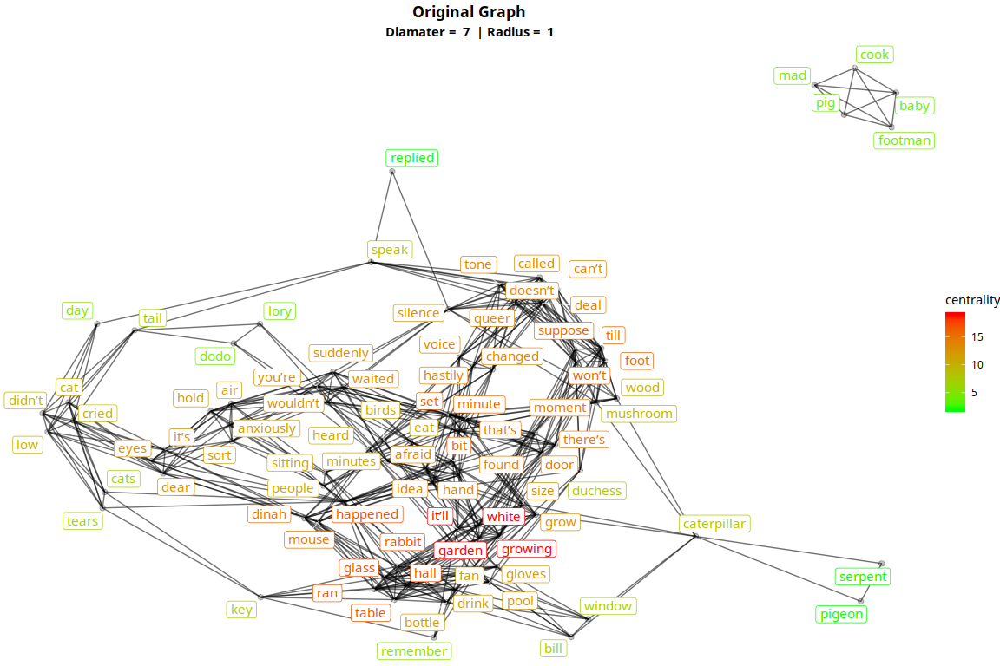

The Louvain algorithm was used for community detection as the communities produced were more interpretable in my opinion. Interestingly the number of communities found was 7 which is half the amount of communities found using Louvain on the entire book.

``` r
#######################
### Louvain ###########
#######################
community.lv <- correlation_graph %>%
  activate(nodes) %>%
  mutate(community = group_louvain())

community.lv_measurements <- community.lv %>%
  as_tibble()

# plot network colored by cluster
ggraph(community.lv, layout = "fr") +
  geom_edge_link(aes(edge_alpha = 0.7), edge_width=0.5, show.legend = FALSE) +
  geom_node_point(aes(color = factor(community)), alpha = 0.25, size = 2) +
  geom_node_label(aes(label = name, color = factor(community)), size = 4, repel = TRUE, segment.color = "red", segment.alpha = 0.7, segment.size = 0.4) + # repel =TRUE stops labels overlapping; but also  attaches a segment line between node and text, which may be visually confusing if it overlaps with graph edges and nodes
  theme_void() +
  labs(title = "Louvain Community Detection",
       subtitle = paste("Communities = ", max(community.lv_measurements$community)),
       color = "Community") +
  theme(plot.title = element_text(hjust = 0.5, face = "bold"),
        plot.subtitle = element_text(hjust = 0.5, face = 'bold'))
```

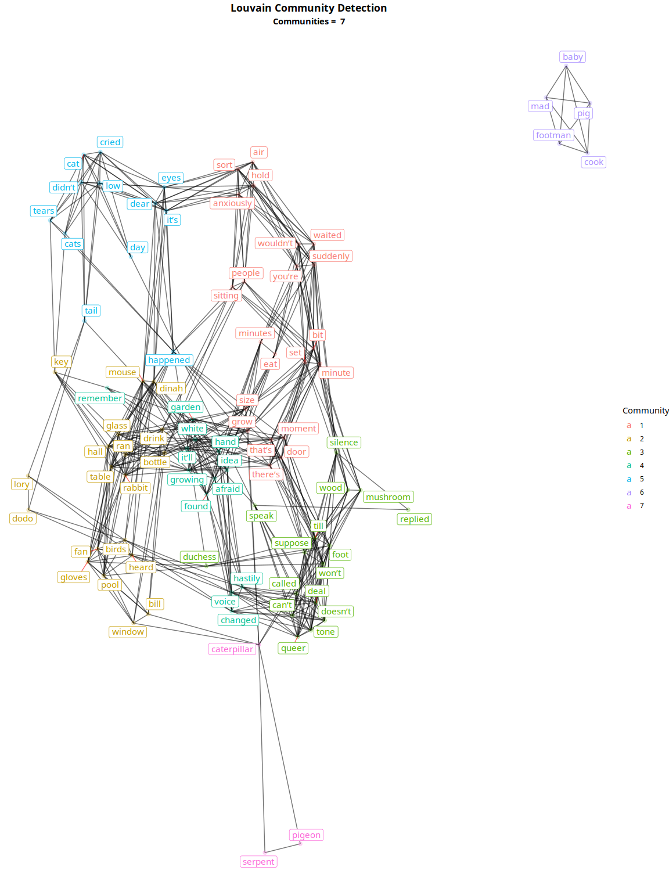

``` r
# separate clustered graph into separate graphs for each cluster
community_graphs <- get_community_graphs(community.lv) # return tbl_graph for each community

# get ggplot for each cluster
community_ggplots <- lapply(community_graphs, get_community_ggraph)
ggarrange(plotlist = community_ggplots, ncol = 3, nrow = 3)
```

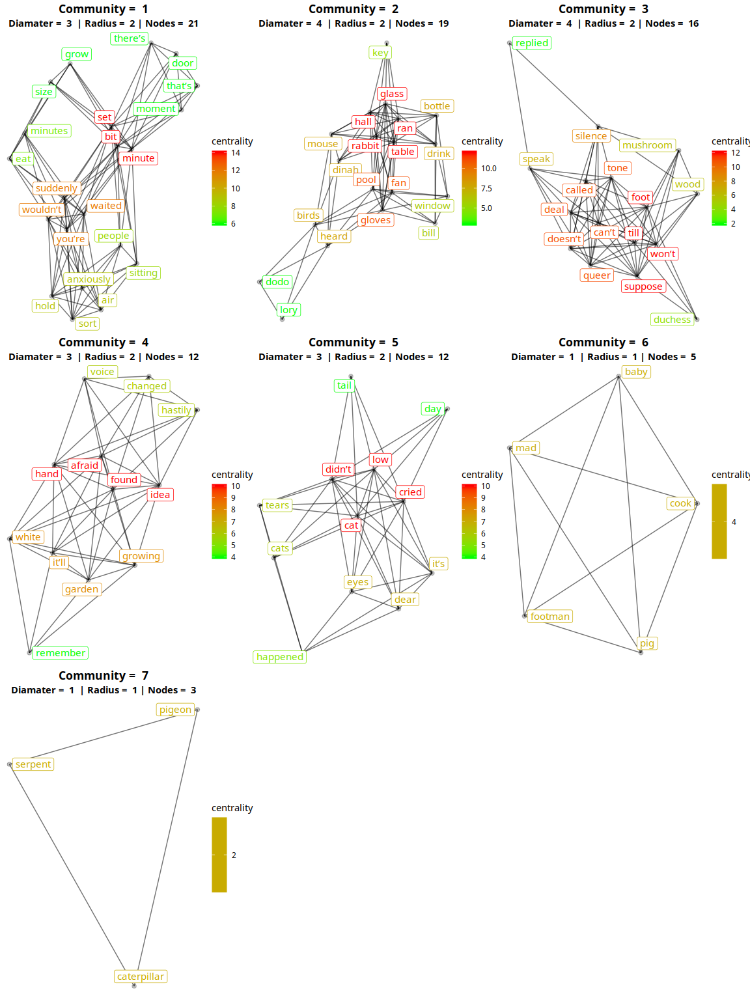

The communities produced here are very similar to the communities produced using Louvain on the entire book. They communities may be smaller in size but the meaning interpreted from each community is very similar to what was previously interpreted.

There is an additional small community here with the words *pigeon, serpent* and *caterpillar* indicating an interaction between these characters.

### Second Half Of The Book

The above process was repeated for the second half of the book to produce a similar set of graphs.

``` r
#################################################
############### Read in Book ######################
#################################################

# Read the text files
book_title = "Alice's Adventures in Wonderland"
chapters = 7:12
chapter_stem = "alice"
ext <-".txt"
folder<- "alice/"

book <- tibble()

# read in each chapter
for(i in chapters){
  
  chapter <-paste0(folder,chapter_stem,i,ext)
  
  raw<-readChar(chapter, file.info(chapter)$size)
  
  chapter_text <- raw %>%
    gsub("[\r\n]+", " ", .) %>%
    gsub('^"',"",.) %>%
    gsub('"$',"",.)
  
  #creates a tibble with 3 cols: book_title, chapter, word
  words <- tibble(title = book_title, chapter=i, text = chapter_text) %>%
    unnest_tokens(word, text) %>% # tokenise the text
    filter(!word %in% stop_words$word) # remove stop words
  
  book <- rbind(book, words) # add rows to the book tibble
  
}


#################################################
############### Word Correlation ######################
#################################################
word_cor <- book %>%
  group_by(word) %>%
  filter(n() >= 7) %>% # minimum number of word pairs to consider; determines the number of nodes; lower value -> more nodes
  pairwise_cor(item=word, feature=chapter) %>% 
  filter(!is.na(correlation), correlation >= 0.6) # minimum correlation; determines the number of edges

#################################################
############### Graph and Measurements ######################
#################################################
correlation_graph <- as_tbl_graph(word_cor, directed = F) %>%
  activate(edges) %>%
  filter(!edge_is_multiple()) # (hello,alice) same as (alice,hello)

original_graph <- correlation_graph %>% 
  activate(nodes) %>%
  mutate(centrality = centrality_degree(),
         diameter = graph_diameter(),
         radius = graph_radius(),
         eccentricity = node_eccentricity())

original_graph_measurements <- as_tibble(original_graph)

ggraph(original_graph, layout = "fr") +
  geom_edge_link(aes(edge_alpha = 0.7), edge_width=0.5, show.legend = FALSE) +
  geom_node_point(alpha = 0.25, size = 2) +
  geom_node_label(aes(label = name, color = centrality), size = 4, repel = TRUE, segment.color = "white", segment.alpha = 0.7, segment.size = 0.4) + # repel =TRUE stops labels overlapping; but also  attaches a segment line between node and text, which may be visually confusing if it overlaps with graph edges and nodes
  theme_void() +
  scale_color_gradient(low = 'green', high = 'red') +
  labs(title = "Original Graph",
       subtitle = paste("Diamater = ", sample(original_graph_measurements$diameter, 1),
                        " | Radius = ", sample(original_graph_measurements$radius, 1))) +
  theme(plot.title = element_text(hjust = 0.5, face = "bold"),
        plot.subtitle = element_text(hjust = 0.5, face = 'bold'))
```

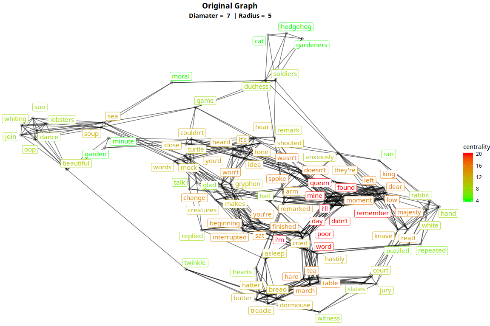

``` r
#######################
### Louvain ###########
#######################
community.lv <- correlation_graph %>%
  activate(nodes) %>%
  mutate(community = group_louvain())

community.lv_measurements <- community.lv %>%
  as_tibble()

# plot network colored by cluster
ggraph(community.lv, layout = "fr") +
  geom_edge_link(aes(edge_alpha = 0.7), edge_width=0.5, show.legend = FALSE) +
  geom_node_point(aes(color = factor(community)), alpha = 0.25, size = 2) +
  geom_node_label(aes(label = name, color = factor(community)), size = 4, repel = TRUE, segment.color = "red", segment.alpha = 0.7, segment.size = 0.4) + # repel =TRUE stops labels overlapping; but also  attaches a segment line between node and text, which may be visually confusing if it overlaps with graph edges and nodes
  theme_void() +
  labs(title = "Louvain Community Detection",
       subtitle = paste("Communities = ", max(community.lv_measurements$community)),
       color = "Community") +
  theme(plot.title = element_text(hjust = 0.5, face = "bold"),
        plot.subtitle = element_text(hjust = 0.5, face = 'bold'))
```

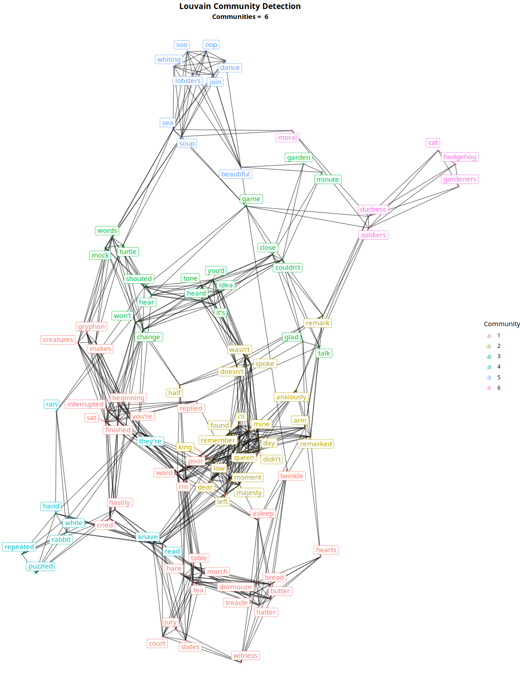

``` r
# separate clustered graph into separate graphs for each cluster
community_graphs <- get_community_graphs(community.lv) # return tbl_graph for each community

# get ggplot for each cluster
community_ggplots <- lapply(community_graphs, get_community_ggraph)
ggarrange(plotlist = community_ggplots, ncol = 3, nrow = 3)
```

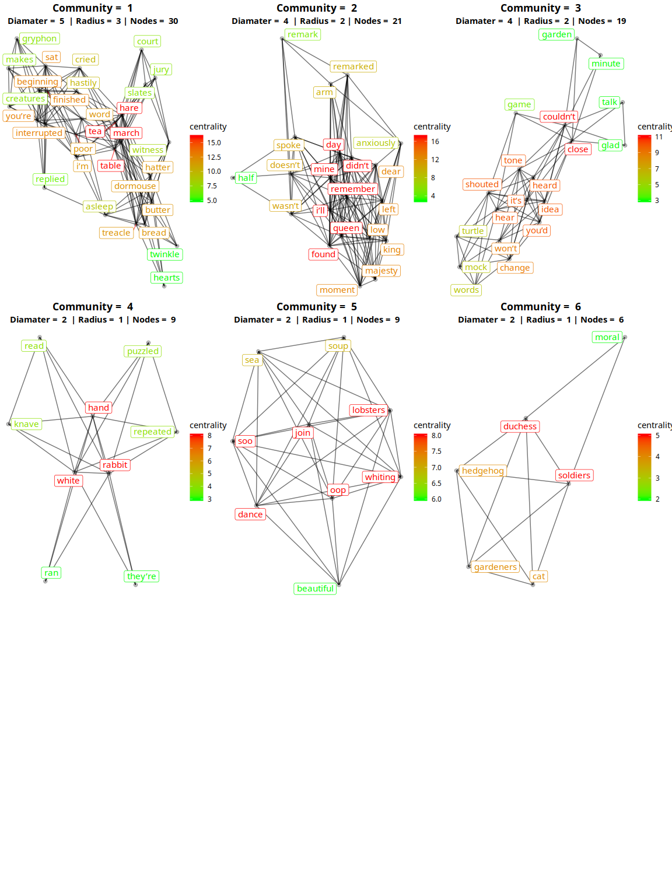

Once again very little extra meaning can be interpreted from these communities that is not already understood.

In community 5 there is a reference to *lobsters* and *soup* in a highly connected graph with the same strange words seen in the highly connected graph from the trigram model. This could be interpreted as the poem or repeated words being about a soup.

Community 6 also introduces the term *hedgehog* and *cat* indicating they were present in the scene involving the duchess and solders in the garden.

Conclusion
----------

By using graph analytics on a text analysis domain it is clear that we can get an insight into the themes and relationships throughout the book.

The use of community detection on the network representing the entire book provided the most insightful graphs that aid in understanding the relationship between characters and their environment.

The use of the n-gram models and analysis of the book in sections did not produce very different insights than the original communities. It can be seen that the overall topic of the communities is the same however some of the terms in the communities are slightly different.

These methods of further investigation were useful however in developing a deeper understanding of the communities that were originally found.

By reading a [summary of the book](https://www.sparknotes.com/lit/alice/summary/)\[2\] it is clear that the themes and relationships extracted from the book are accurate to the events that occur in the story.

Although they may not be enough by themselves to accurately interpret the story, they do succeed in providing a rough insight into the relationships and events in the actual book.

Another interesting feature of this book was that it contained 11 poems. Poems often repeat terms and sequences of words which were present in the graphs produced from the network analysis. The most prolific poem words came from poems such as *"You are old, Father William"*, *"Twinkle, twinkle, little, bat"*, *"The Lobster Quadrile"*, *"Turtle Soup"* and *"The letter in the trial"*.

It is interesting that the names of these poems are recognisable based on the topics and terms extracted from the network analysis. Further reading on the [poems of the book](http://www.alice-in-wonderland.net/resources/analysis/poem-origins/alices-adventures-in-wonderland/)\[3\] can be found in the embedded hyperlink.

References
----------

\[1\] Carroll, A. (2019). Alice's Adventures in Wonderland by Lewis Carroll. \[online\] Project Gutenberg. Available at: <http://www.gutenberg.org/ebooks/11> \[Accessed 8 Apr. 2019\].

\[2\] Sparknotes.com. (2019). SparkNotes: Alice’s Adventures in Wonderland: Plot Overview. \[online\] Available at: <https://www.sparknotes.com/lit/alice/summary/> \[Accessed 8 Apr. 2019\].

\[3\] Alice-in-Wonderland.net. (2019). Poem origins: Alice's Adventures in Wonderland - Alice-in-Wonderland.net. \[online\] Available at: <http://www.alice-in-wonderland.net/resources/analysis/poem-origins/alices-adventures-in-wonderland/> \[Accessed 8 Apr. 2019\].
